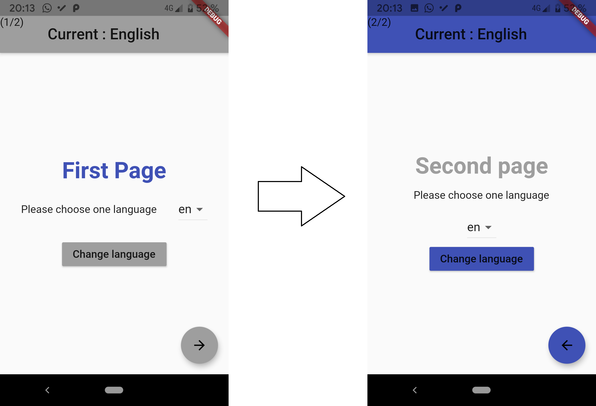
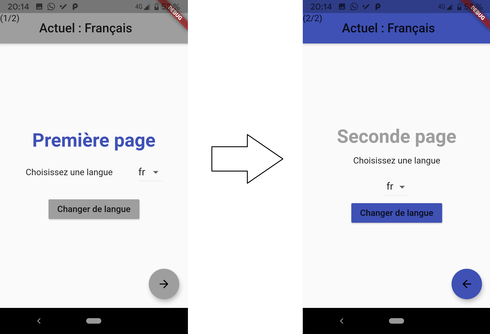

# Manage Flutter Internationalization (with JSON)

Flutter project example to manage internationalization (different languages) using JSON file

## How to

* Copy the directory `lib/internalialization/` in your `lib/` directory
  
* Create all translation files (with the same keys) in the i18n folder.  
  
  The name of each file should be the same as the one contained in the `supportedLanguages` variable (List) in the `lib/ internationalization/internationalization.dart` file

* Add these lines in the `pubspec.yaml` file :  
  
```dart
dev_dependencies:
  flutter_test:
    sdk: flutter
  flutter_localizations: # ADD THIS
    sdk: flutter # AND THIS
```

* After that you can use this import

```dart
// ADD THIS IMPORT 
import 'package:flutter_localizations/flutter_localizations.dart';

// ADD THIS IN YOUR MAIN CLASS
import 'internationalization/init_i18n.dart';
Map<String, Map<String, String>> localizedValues = await initializeI18n();

// ADD THIS IN YOUR MATERIAL APP
localizationsDelegates: [
    InternationalizationDelegate(this.localizedValues),
    GlobalMaterialLocalizations.delegate,
    GlobalWidgetsLocalizations.delegate,
],
supportedLocales: supportedLanguages.map(
    (language) => Locale(language, '')
),
```

* If you are in another file do not forget the import (Change according to the path):

```dart
import 'internationalization/Internationalization.dart';
```

* USE JSON FILE (Internationalization)

  We assume that our JSON contains the key "hello" like this :

  ```json
  {
    "_comment": "file en.json",
    "hello": "Hello"
  }
  
  {
    "_comment": "file fr.json",
    "hello": "Hello"
  }

  {
    "_comment": "file it.json",
    "hello": "Ciao"
  }
  ```
  
  In your dart code, use like this :

```dart
// In a string
String helloText = Internationalization.of(context).greetTo('hello');
// or in the Widget
Text(Internationalization.of(context).greetTo('hello'),),
```

## Screenshots examples





## Author

* [Avi Mimoun](https://www.github.com/av1m)

## Repository available on Github

* [Link of this repository](https://github.com/av1m/JsonInternationalization)
